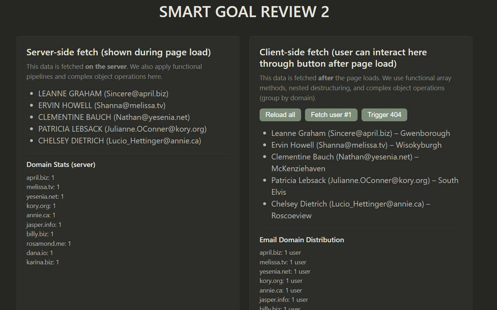
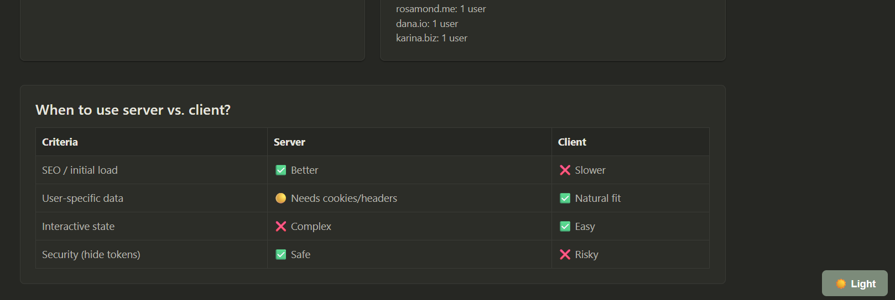
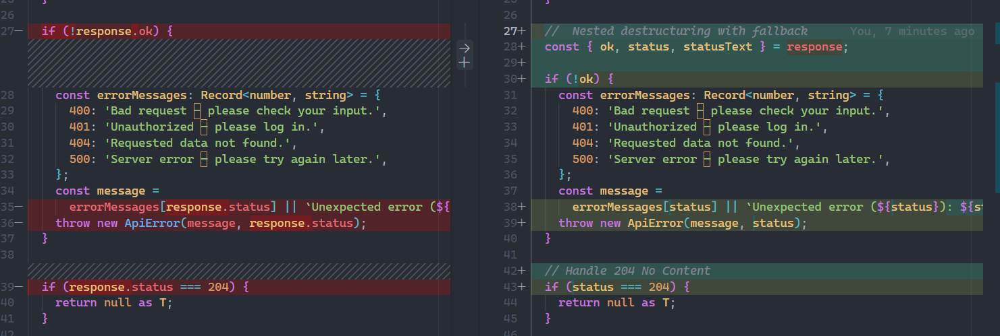
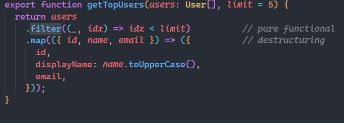
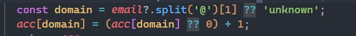
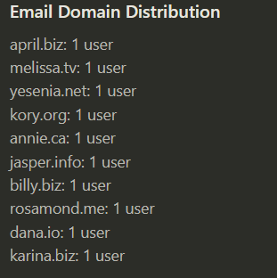

# Self-Review: smart goal 2

## Hosted link: https://smart-goal-one.vercel.app/service-demo
## visual preview 

### 1. Nested Destructuring
I applied nested destructuring in the `apiRequest` function: `const { ok, status } = response`. This made the status check much more readable than `response.ok` and `response.status`. I also used destructuring with fallback when extracting `address.city`: `const { address: { city = 'No city' } = {} } = user`. This improved readability by removing repetitive `if` checks.

### 2. Functional Array Methods
I replaced `.slice(0,5)` with a pipeline of `.filter().map().reduce()` in `getTopUsers`. I also used `reduce` to group users by email domain (`groupByDomain`).

### 3. Safe Property Access
I learned that optional chaining (`?.`) and nullish coalescing (`??`) are not enough when the intermediate property might be missing entirely. For `address.city`, using `const { address: { city } = {} } = user` provides a safe default. This technique avoids the common "Cannot read property of undefined" error.

### 4. Complex Object Operations
I implemented `groupByDomain` using `reduce`. The challenge was handling emails that might be malformed – I used `email?.split('@')[1] ?? 'unknown'` to gracefully degrade.
output : 
